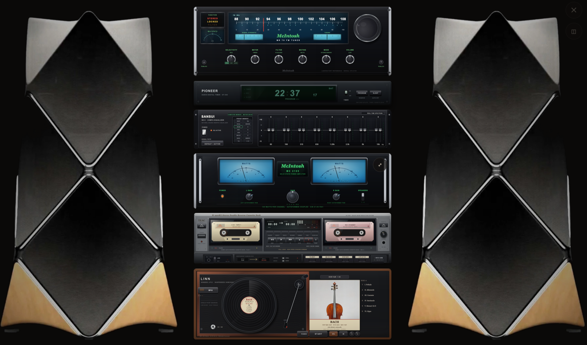

# FM 라디오 모음

KBS·MBC·CBS·SBS·EBS 등 한국 주요 FM 라디오를 한 화면에서 듣는 웹 앱.
실물 하이파이 랙(튜너·이퀄라이저·앰프·카세트 데크·턴테이블)을 SVG로 재현해,
다이얼을 돌려 선국하고 테이프에 녹음하는 아날로그 경험을 그대로 옮겼다.



## 기능

- **선국** — 튜너 다이얼 드래그/노브 회전, 채널 목록, 즐겨찾기, 마지막 채널 복원
- **녹음** — 카세트 데크 메타포(C-30 테이프, 30분 단위 위치 기반), MediaRecorder + IndexedDB
- **취침 타이머** — 튜너 IF MODE 스위치로 순환 설정
- **턴테이블·카세트** — 방송 외 매체 재생, 매체 우선권(음반이 도는 동안 튜너는 대기 선국)
- **스킨** — 튜너 4종(T-2, MR-78, 10B, TU-9900) × 앰프 4종(CA-100, EL34, 300B, KT88)
- **PWA** — 오프라인 앱 셸, 홈 화면 설치, 미디어 세션(잠금화면 컨트롤)
- **미니 플레이어 / 임베드** — `widget.html`(팝업·iframe), postMessage API 제공 (`embed.html` 문서 참고)

## 구조

```
index.html          본체 (CSS·HTML·JS 단일 파일)
stations.js         채널 정의 + 스트림 URL 해석 (index/widget 공유)
player-core.js      재생 코어 — HLS/네이티브/파일 경로와 오류 복구 (index/widget 공유)
widget.html         미니 플레이어 (iframe/팝업용)
embed.html          위젯·임베드 사용 설명서
sw.js               서비스워커 — 앱 셸만 캐싱, 스트림은 통과
manifest.webmanifest PWA 매니페스트
mbc-proxy.js        MBC 스트림 URL 해석용 개인 프록시 (Node, 선택)
mbc-proxy.service   위 프록시의 systemd 유닛
```

### 채널 추가 방법

`stations.js`의 `stations` 배열에 항목 1개를 추가하면 끝난다.
그룹 섹션·채널 수·다이얼 마커는 모두 이 배열에서 자동 생성된다.

```js
{ id: "myfm", freq: 101.3, name: "새 FM", desc: "설명", group: "etc",
  color: "#7d5b78", type: "direct", streamUrl: "https://.../playlist.m3u8" }
```

- `type: "direct"` — `streamUrl`의 HLS를 바로 재생
- `type: "kbs-api" | "sbs-api" | "mbc-api"` — `apiUrl`에서 실제 스트림 URL을 해석

### MBC 프록시

MBC는 스트림 URL 발급에 서버 측 호출이 필요해 개인 프록시(`mbc-proxy.js`)를 둔다.
프록시가 죽으면 MBC 채널만 연결 실패하고 나머지는 영향 없다.

## 개발·배포

정적 파일뿐이므로 아무 정적 서버로 열면 된다:

```bash
npx http-server -p 8080        # http://127.0.0.1:8080
```

배포는 정적 호스팅(GitHub Pages 등)에 저장소 루트를 그대로 올리면 된다.
서비스워커 캐시 키(`sw.js`의 `CACHE`)는 셸 자산이 바뀔 때 버전을 올린다.
`index.html`의 `og:url`/`og:image`는 GitHub Pages 주소를 절대 URL로 박아두었으니
커스텀 도메인에 배포한다면 함께 바꿔 준다.

푸시마다 GitHub Actions(`.github/workflows/test.yml`)가 스모크 테스트를 돌린다.

## 테스트

```bash
cd tests
npm install
npx playwright install chromium   # 최초 1회
npm test
```

Playwright 스모크 테스트가 렌더링·선국·재생(모의 HLS)·키보드 조작·검색·
미니 플레이어·모바일 뷰포트를 검증한다. 외부 의존(CDN·방송사 API·스트림)은
전부 모킹되므로 오프라인에서도 돌고, 실제 방송 연결 여부는 환경에 좌우되므로
테스트하지 않는다.

실제 방송 스트림이 살아 있는지는 로컬에서 따로 점검한다:

```bash
cd tests && npm run live
```

## 저작권

방송 스트림의 저작권은 각 방송사에 있다. 녹음 파일은 개인 감상 용도로만 사용할 것.
