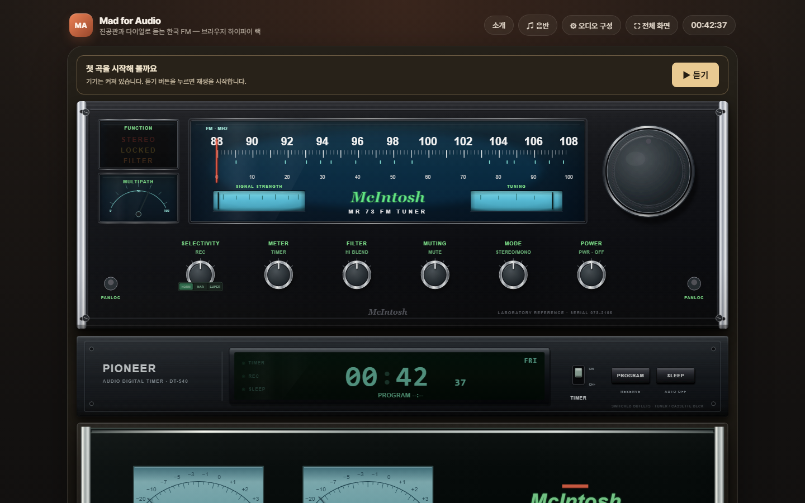
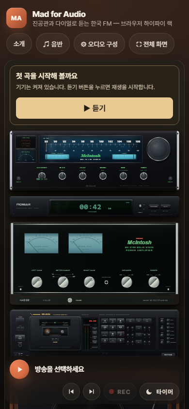

# 전체 기능·성능·UX 점검 — v189

2026-09-11, 기준 커밋 `53cee97`(v188). 첫 재생 경로, 라디오·음반·테이프·예약,
SVG 기기 모델과 모바일 화면, 저장소와 연결 수명주기, PWA·트레이 배포 경계를 점검했다.
첫 실행 때 컴포넌트를 껐다 켜야 하는 동선을 고치고, 실제로 재현한 결함을 중심으로 수정했다.

## 정량 결과

성능은 Windows의 Playwright Chromium에서 CPU 4배 감속, 1440×900 및 390×844,
새 브라우저 컨텍스트, 서비스워커 차단, 외부 CDN·방송은 로컬 모의 응답으로 측정했다.
v188을 별도 정적 서버로 서빙하고 변경 전·후를 번갈아 각 3회 실행한 **중앙값**이다.
실제 휴대전화의 CPU 사용률이나 인터넷 속도를 뜻하지 않는다.

| 지표 | v188 | v189 | 평가 |
|---|---:|---:|---|
| 데스크톱 첫 화면 재생 버튼 | 숨김 | 상단에 표시, 클릭 1회 재생 | 전원 재조작 동선 제거 |
| 모바일 CLS | 0.9412 | 0.0069 | 초기 화면 밀림 약 99.3% 감소 |
| 데스크톱 CLS | 0.0383 | 0.0003 | 초기 화면 안정성 개선 |
| 모바일 유휴 5초의 메인 스레드 작업 | 882.9ms | 56.3ms | 이 화면 조건에서 약 93.6% 감소 |
| 데스크톱 유휴 5초의 메인 스레드 작업 | 64.5ms | 58.0ms | 약 10.0% 감소 |
| 모바일 초기 앱 준비 | 1,144ms | 1,212ms | 약 68ms 증가, 시작 시간 개선은 확인하지 못함 |
| 데스크톱 초기 앱 준비 | 1,246ms | 1,220ms | 비슷한 수준 |
| 모바일 초기 긴 작업의 50ms 초과분 합계 | 703ms | 688ms | 큰 스크립트 실행 부담은 여전히 남음 |
| 동일 출처 자산의 압축 해제 후 크기 | 1.613MB | 1.615MB | 전송량 감소 작업은 아님 |
| 기본 화면 DOM 노드: 데스크톱 / 모바일 | 4,083 / 4,077 | 4,084 / 4,084 | SVG 밀도가 높음 |
| 유휴 rAF 콜백 | 5초당 5회 | 5초당 5회 | 기존 상태 기반 스케줄러 유지 |
| 기본 화면 axe WCAG A·AA 위반: 두 크기 | 0 / 0 | 0 / 0 | 자동 검사 범위에서 유지 |
| 두 크기의 가로 넘침 | 0px / 0px | 0px / 0px | 유지 |
| 트레이 빌드 의존성의 높은 위험도 취약 패키지 | 6개 | 0개 | 호환 패치 버전으로 갱신 |
| 웹 테스트 의존성의 취약 패키지 | 0개 | 0개 | 유지 |
| 전체 브라우저 회귀 | 129개 통과 + 1개 재시도 통과 | 152개 첫 시도 통과 + 1개 명시적 제외 | 재시도 0회로 검증 |
| 실제 방송 URL·HLS 첫 응답 | 13/15 | 15/15 | MBC 프록시 TLS 복구 후 전 채널 응답 |

모바일 LCP 관측값은 304ms에서 1,144ms로 증가했다. 첫 화면 구성과 최대 콘텐츠 후보가
달라졌으므로 빠른 로딩으로 포장하지 않는다. 상단 안내 추가로 화면 안에 들어오는 기기
범위도 달라졌다. 유휴 작업량 감소에는 같은 값의 SVG 변환 재기록 방지, 불필요한 숨김 요소
제거와 이 화면 구성 변화가 함께 반영되며, 각 원인의 효과를 따로 분리한 수치는 아니다.
CLS는 사용자 입력 전 짧은 로딩 구간의 합계로 수집했다. 운영 사용자 기반 지표는 아니다.

[측정 원자료와 3회 결과](review-2026-09-11/measurements.json)

## 발견한 결함과 반영

| 우선순위 | 문제와 근거 | 반영 |
|---|---|---|
| P1 | 기본 데스크톱 랙은 플레이어를 숨기는데 전원은 모두 켜져 있었다. 기존 첫 재생 테스트도 간편 화면으로 전환한 뒤에만 버튼을 눌렀다. | 랙 상단에 듣기·일시정지·연결 취소·다시 연결을 제공한다. 별도 자동재생 제한 프로젝트에서 실제 미디어 진행을 검사한다. |
| P1 | `setTunerPower(false)`가 이미 재생 중인 경우만 정리해 주소 조회 중 전원을 끄면 늦은 응답이 재생을 시작할 수 있었다. | 조회·버퍼링 중에도 재생 세대를 폐기한다. 응답을 붙잡았다 취소 후 풀어 주는 테스트를 추가했다. |
| P1 | 개인 방송 음반 목록 조회가 연결 해제 뒤 끝나면 캐시와 목록이 복원될 수 있었다. | 요청 당시 연결과 현재 연결을 비교하고, 페어링에도 세대 검증을 적용했다. 늦은 새로고침 응답 테스트를 추가했다. |
| P1 | MBC 프록시의 기존 도메인 인증서가 9월 6일 만료됐다. `curl`이 `SEC_E_CERT_EXPIRED`로 실패했다. | 스트림·편성표 주소와 서버 인증서를 `ducklove.duckdns.org`로 통일했다. 서버에 직접 반영한 뒤 TLS 검증을 유지한 상태로 15/15 HLS 응답을 확인했다. |
| P2 | `records.json`이 응답을 끝내지 않으면 `Promise.all`이 앱 전체 부팅을 무한 대기시켰다. | 8초 뒤 카탈로그 요청을 중단하고 포노만 제한한 채 라디오를 시작한다. 본체 파일 로딩 실패에는 다시 불러오기 버튼을 제공한다. |
| P2 | 모달 닫기 후 rAF로 예약된 포커스 복원이 사용자가 이동한 EQ 슬라이더 포커스를 빼앗았다. 기존 검사에서도 1회 실패 후 재시도 통과했다. | 배경의 inert 해제 직후 포커스를 돌려주고, 다음 프레임에서도 EQ 조작이 이어지는지 검사한다. |
| P2 | 컴포넌트의 `display:flex`가 `hidden`을 덮어써 예약 0개 버튼과 빈 상태 칩이 보였다. | `[hidden]`의 표시 계약을 전역으로 보장하고 첫 화면에서 숨겨졌는지 검사한다. |
| P2 | 초기 빈 랙 아래 콘텐츠와 헤더의 버튼 줄이 SVG 마운트 후 크게 이동했다. | 로딩 중 랙 공간을 확보하고 기본 랙의 헤더 상태를 HTML부터 맞췄다. |
| P2 | 트레이의 빌드 도구 의존성 6개에 높은 위험도 권고가 있었다. | `@xmldom/xmldom`, `brace-expansion`, `fast-uri`, `js-yaml`, `tar`, `undici`를 기존 허용 범위의 패치로 갱신했다. CI에 두 lockfile의 취약점 검사를 추가했다. |

## 구조와 코드

- `listening-controls.js`는 안내 DOM 갱신과 이벤트 구독·해제를 맡는다. 재생·전원 정책은
  `app.js`가 소유하고 읽기/조작 콜백으로 연결한다. 사용하지 않게 된 코치마크 코드와 CSS를 제거했다.
- `listeningConnectionPending()`으로 실제 연결 대기 판정을 공유한다. 테이프의 빈 구간을
  네트워크 대기로 오인하지 않도록 데크 재생 경로를 구분한다.
- `resumeListeningAudio()`로 클릭 안에서 오디오 그래프를 준비하고 중단된 컨텍스트를 재개한다.
  Chromium의 [공식 자동재생 정책](https://developer.chrome.com/blog/autoplay)에 맞춘 동작이다.
- `app.js`는 카탈로그와 병렬로 미리 다운로드하되 기존 classic 스크립트 실행 순서는 유지한다.
- SVG 회전·이동·복합 변환은 값이 달라질 때만 속성을 쓴다. 기존 공통 rAF 스케줄러와
  숨은 탭 중지 동작을 유지한다.
- v189의 HTML·CSS·서비스워커 자산 버전을 함께 올리고 새 모듈을 오프라인 캐시에 포함했다.
- MBC 프록시는 `TLS_CERT_NAME`으로 인증서 경로를 정하고 매시간 파일 변경을 확인해
  `setSecureContext()`로 갱신한다. 파일을 읽지 못하면 기존 인증서와 연결을 유지한다.
  기존 코드와 서버 코드가 동일함을 확인하고 백업 후 한 파일만 교체해 서비스를 재시작했다.
  새 인증서는 2026-12-05까지 유효하다. 인증서 재발급 자체는 서버의 기존 갱신 작업이 맡는다.

## 검증 범위와 남은 부담

기준 테스트는 129개가 첫 시도에 통과했고 EQ 키보드 테스트 1개가 재시도에 통과했다.
수정 후에는 자동재생 제한 Chromium, 일반 Chromium, WebKit에서 첫 재생과 취소를 검사한다.
최종 전체 실행은 2.5분에 152개 통과, 실패 0개, 재시도 0회였다. WebKit에서는
앱이 Web Audio 그래프를 만들지 않으므로 Chromium 전용 컨텍스트 재개 검사 1개를 제외했다.
Chromium은 시간 진행뿐 아니라 `AudioContext=running`, 출력 게인, 분석기의 비영(非零)
오디오 샘플을 확인한다. WebKit은 로컬 MP3의 네이티브 재생 경로를 검사한다.
자동 테스트는 소리의 음질을 청취 평가한 결과가 아니다.

모킹 없는 로컬 앱에서도 설치된 Chrome으로 1440px·390px 두 화면의 KBS 1FM을 검사했다.
버튼 클릭 1회, 실제 미디어 시간 진행, `AudioContext=running`, 출력 게인 약 0.588,
분석기의 오디오 신호, 스피커 경로 개방과 일시정지를 확인했고 페이지 예외는 0개였다.
이 환경의 Playwright 기본 Chromium은 AAC를 지원하지 않으므로, 실제 방송 검증 도구는
설치된 Chrome을 사용하고 시작할 때 AAC 지원을 확인한다. 테스트 브라우저의 코덱 부재를
방송 장애로 판정하지 않는다.

회귀 범위에는 선택 모델 20종과 단독 기기, 음반 86장·494곡의 형식, 검색·셔플,
테이프 영속화·삭제·가져오기·양면·더빙, 예약 녹음과 동시 재생, 미니 플레이어,
모달 포커스, 트레이 메시지 검증, 서비스워커 오프라인 부팅이 포함된다.

본체 `app.js`는 여전히 약 8,970줄·470KB, 데크는 약 1,700줄·99KB다.
SVG 카탈로그 3개도 합계 약 490KB로 초기 실행 부담이 남는다. 이번 작업의 모듈 분리는
재생 안내 경계에 한정된다. 전역 상태 전체의 구조 개편이나 모델별 지연 로딩은
다수의 인라인 조작·오프라인·네이티브 셸 계약을 함께 바꾸므로 후속 개선 대상으로 남긴다.

axe 결과는 기본 화면의 자동 검사이며 전체 수동 접근성 인증이 아니다. 320px·390px·640px
및 몰입 화면은 기존 회귀 검사로 확인한다. iPhone 실기, webOS TV, macOS 네이티브 앱,
장시간 발열·배터리, 494곡 전부의 외부 파일 연결 상태는 이번 실행에서 실기 검증하지 않았다.
실제 방송 15/15 결과도 주소 해석과 첫 HLS 응답 기준이며 15개 방송의 장시간 재생을 뜻하지 않는다.
트레이 lockfile 수정은 빌드 도구에 해당하며 배포한 1.1.0 설치 파일을 교체하는 작업은 아니다.
Windows x64 디렉터리 패키징과 ASAR 파일 4개·필수 웹 자산 5개 포함 검증은 통과했다.

## 재현

```powershell
# 저장소 루트의 정적 서버를 8123 포트에서 실행
cd tests
npm test -- --workers=3 --retries=0
node audit-runtime.js current
npm run live
node live-app-check.js http://127.0.0.1:8123/ 189
npm audit --audit-level=high
cd ../tray
npm run check
npm audit --audit-level=high
```

측정 도구는 `tests/artifacts/runtime-audit/`에 JSON과 화면을 저장한다.
이 문서의 원자료에는 변경 전·후 각 3회, 두 화면 크기의 총 12개 관측이 들어 있다.




